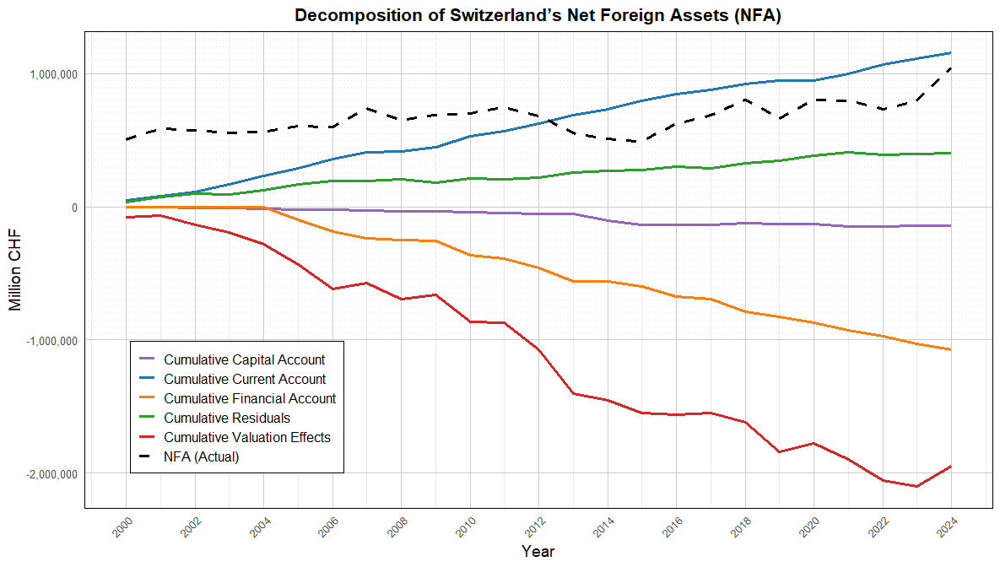
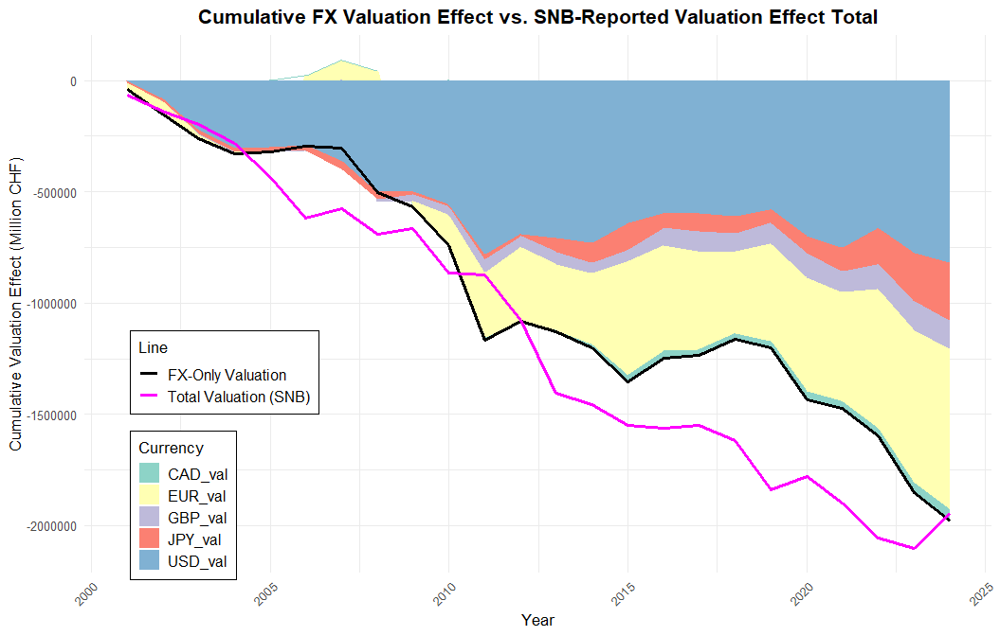

1. Decomposing Changes in Net Foreign Assets (NFA)
We begin by decomposing the change in Switzerland’s NFA position into two main components:
ΔNFAₜ = CAₜ + VEₜ
Where:
	ΔNFAₜ : Change in net foreign assets-  over the period (2000–2024)
	CAₜ:  Current account balance
	VEₜ:  Valuation effects (including capital gains/losses and exchange rate impacts)
This decomposition allows us to ask: Is Switzerland’s NFA improving due to persistent current account surpluses, or is it earning superior returns on its external assets?

A stronger CHF (appreciation) causes a negative valuation effect in CHF.

That is:

Foreign currencies weaken against the CHF

Therefore, NFA in CHF terms drops

-This is shown in the chart as a downward trend in both:

-The stacked FX valuation areas (especially USD)

-The black line (FX-only valuation)

-The magenta line (total SNB valuation)

What does negative valuation effect mean here?
In this context:

The Swiss Net Foreign Assets (NFA) are held in foreign currencies.

When the Swiss franc (CHF) appreciates, those foreign assets are worth less in CHF terms.

So the valuation effect becomes negative — not because the assets lost value abroad, but because their value in CHF declined.
